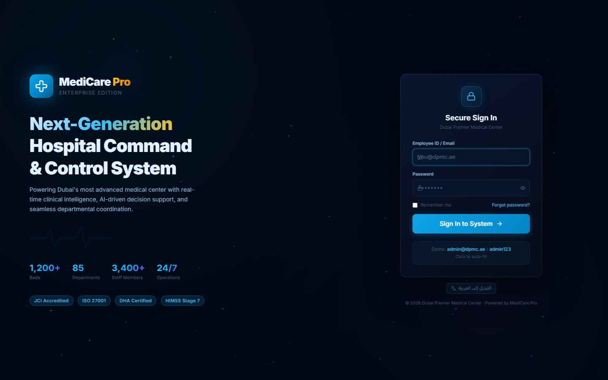
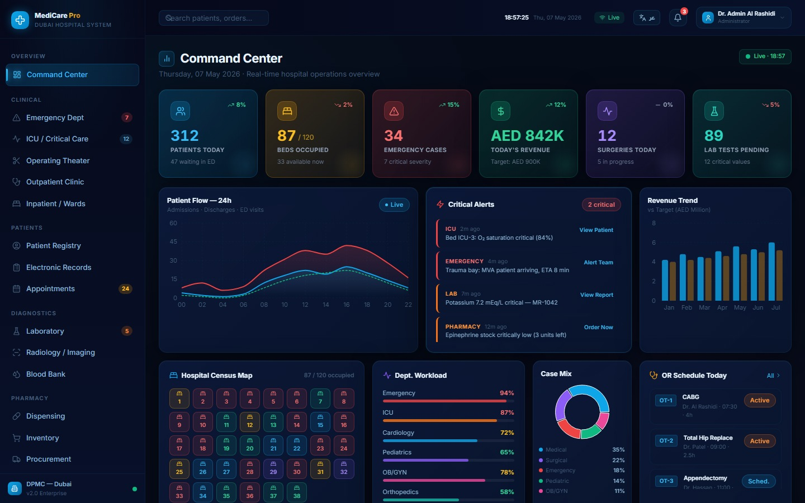
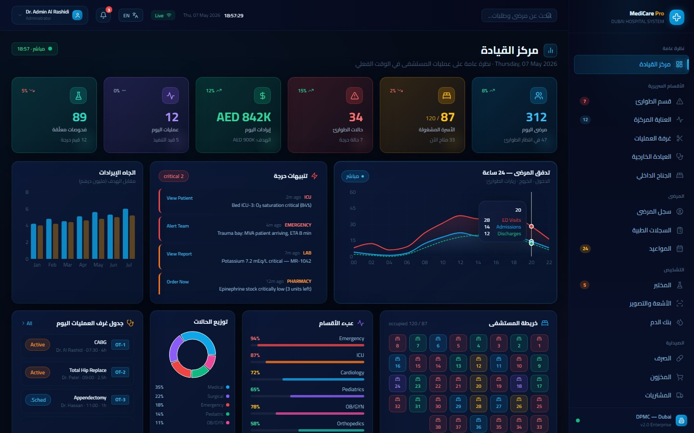

<div align="center">


# MediCare Pro — Enterprise Hospital Management System

**Next-generation clinical command center built for large-scale hospital operations**

[](https://www.electronjs.org)
[](https://reactjs.org)
[](https://vitejs.dev)
[](https://nodejs.org)
[](https://www.postgresql.org)
[](https://www.i18next.com)

> A complete, production, ready hospital information system, covering every department from emergency triage and ICU monitoring to pharmacy dispensing, billing, staff management, and real-time analytics. Built for a 1,200-bed tertiary care hospital, with full Arabic/English bilingual support and native RTL layout.

</div>

---

## Screenshots

<div align="center">

### Secure Sign-In Portal


*Animated particle canvas, live ECG decoration, hospital statistics, and JCI/ISO certification badges — all on the login page.*

---

### Command Center Dashboard — English


*Real-time hospital operations overview: 6 live metric cards, patient flow chart, critical alerts feed, revenue trend, bed census map, department workload, OR schedule, and quick-action shortcuts.*

---

### Command Center Dashboard — العربية (Arabic RTL)


*One-click language switch flips the entire interface to full RTL Arabic — sidebar mirrors right, content flows right-to-left, and every label renders in medical Arabic via the Cairo typeface.*

</div>

---

## Why MediCare Pro?

Most hospital software is either too expensive, too slow, or too hard to use. MediCare Pro was built from scratch to feel as fast and modern as a consumer app while handling real clinical workflows. Every screen was designed for how staff actually work — doctors don't want to click five times to see a patient's vitals, and a pharmacy tech shouldn't need training to find low-stock alerts.

The entire system runs as a native desktop application — no browser dependency, no tab clutter, no internet required for day-to-day operations. The backend syncs in the background.

---

## What's Inside

### 21 Fully Functional Screens

| Module | Screens | Key Capability |
|--------|---------|---------------|
| **Command Center** | Dashboard | Live metrics, patient flow chart, critical alerts, OR schedule, bed census map |
| **Emergency Dept** | ED Triage | ESI triage queue, waiting times, bed assignment |
| **ICU / Critical Care** | ICU Monitor | Per-bed vitals, ventilator & vasopressor status, LOS tracking |
| **Operating Theater** | OR Schedule | Procedure list, surgeon assignment, room status |
| **Outpatient** | Clinic Queue | Live queue board, walk-in vs. appointment, doctor panel |
| **Inpatient / Wards** | Ward View | Admitted patients, bed map, discharge planning |
| **Patient Registry** | Patient List | Search, MR number, insurance, blood type, admission history |
| **Electronic Records** | EMR | 6-tab chart: SOAP notes, vitals, labs, medications, problem list |
| **Appointments** | Scheduler | Book, reschedule, status tracking |
| **Laboratory** | Lab Orders | Order tests, results, critical value flagging |
| **Radiology** | Worklist | Modality queue, report panel, STAT flagging |
| **Blood Bank** | Inventory | Blood type stock, request management, donor directory |
| **Dispensing** | Pharmacy POS | Prescription fill, stock check, dispense confirmation |
| **Inventory** | Stock | Medicine stock levels, expiry tracking, reorder alerts |
| **Procurement** | Purchase Orders | Supplier directory, PO creation, receive stock |
| **Billing & Insurance** | Invoices | Invoice creation, insurance claims, patient share |
| **Staff Management** | HR | Employee records, shift scheduling, credentials |
| **Quality & JCI** | QA Dashboard | KPI tracking, incident reports, audit items, accreditation status |
| **Business Intelligence** | Analytics | Revenue trends, case mix, department performance |
| **Settings** | System Config | Language, hospital profile, security, integrations |

---

## Bilingual — Arabic & English

Language is a first-class citizen, not an afterthought. Switching between Arabic and English:

- Instantly flips the **entire UI** — sidebar, navigation, all labels, chart headings, status badges, and form fields
- Activates a full **RTL layout** — sidebar moves to the right, content flows right-to-left, active indicators mirror correctly
- Switches the **typeface** — Cairo (optimized for medical Arabic terminology) replaces Inter
- Persists the choice **across sessions** via localStorage — the app remembers the user's language on next launch
- Works on **every screen**, including the login branding panel, dashboard metrics, and all module pages

---

## Tech Stack

### Desktop App

| Technology | Version | Purpose |
|---|---|---|
| Electron | 28 | Native desktop shell (Windows / macOS / Linux) |
| React | 18 | UI framework |
| Vite | 5 | Build tool and dev server |
| React Router DOM | v6 | Client-side routing |
| Zustand | 4 | Global auth state |
| Framer Motion | 11 | Page and component animations |
| Recharts | 2 | All charts (area, bar, line, pie) |
| Tailwind CSS | 3 | Utility-first styling |
| i18next + react-i18next | — | Bilingual AR/EN with RTL support |
| Lucide React | — | Icon library |
| date-fns | — | Date formatting |
| Axios | — | HTTP client with JWT interceptors |

### Backend API

| Technology | Purpose |
|---|---|
| Node.js + Express | REST API server |
| Prisma ORM | Type-safe database access |
| PostgreSQL | Relational database |
| JWT + bcryptjs | Authentication and password hashing |
| Helmet + CORS | API security headers |

---

## Project Structure

```
medicare-plus/
│
├── desktop/                        # Electron + React desktop app
│   ├── electron/
│   │   └── main.js                 # Electron main process
│   ├── src/
│   │   ├── api/                    # Axios instance + API service files
│   │   │   ├── axios.js            # Auth interceptors, token management
│   │   │   ├── patients.api.js
│   │   │   ├── appointments.api.js
│   │   │   ├── lab.api.js
│   │   │   ├── pharmacy.api.js
│   │   │   └── reports.api.js
│   │   ├── components/
│   │   │   ├── layout/
│   │   │   │   ├── Layout.jsx      # Root layout with sidebar + topbar
│   │   │   │   ├── Sidebar.jsx     # Collapsible nav with i18n labels
│   │   │   │   └── TopBar.jsx      # Search, alerts, user menu, language toggle
│   │   │   └── ui/                 # GlassCard, MetricCard, Badge, Button
│   │   ├── i18n/
│   │   │   ├── index.js            # i18next init, setLanguage(), RTL toggle
│   │   │   └── locales/
│   │   │       ├── en.json         # English translations
│   │   │       └── ar.json         # Arabic translations (full RTL)
│   │   ├── screens/                # One folder per module
│   │   │   ├── Auth/LoginScreen.jsx
│   │   │   ├── Dashboard/DashboardScreen.jsx
│   │   │   ├── Emergency/EmergencyScreen.jsx
│   │   │   ├── ICU/ICUScreen.jsx
│   │   │   ├── Surgery/SurgeryScreen.jsx
│   │   │   ├── Outpatient/OutpatientScreen.jsx
│   │   │   ├── Ward/WardScreen.jsx
│   │   │   ├── Patients/PatientsScreen.jsx
│   │   │   ├── EMR/EMRScreen.jsx
│   │   │   ├── Appointments/AppointmentsScreen.jsx
│   │   │   ├── Lab/LabScreen.jsx
│   │   │   ├── Radiology/RadiologyScreen.jsx
│   │   │   ├── BloodBank/BloodBankScreen.jsx
│   │   │   ├── Pharmacy/
│   │   │   │   ├── PharmacyScreen.jsx
│   │   │   │   ├── InventoryScreen.jsx
│   │   │   │   └── ProcurementScreen.jsx
│   │   │   ├── Billing/BillingScreen.jsx
│   │   │   ├── Staff/StaffScreen.jsx
│   │   │   ├── Quality/QualityScreen.jsx
│   │   │   ├── Analytics/AnalyticsScreen.jsx
│   │   │   └── Settings/SettingsScreen.jsx
│   │   ├── store/
│   │   │   └── auth.store.js       # Zustand auth store
│   │   ├── App.jsx                 # Routes + auth guard + logout listener
│   │   ├── main.jsx                # React root
│   │   ├── index.css               # Global styles + RTL overrides
│   │   └── constants.js
│   ├── tailwind.config.js
│   ├── vite.config.js
│   └── package.json
│
├── backend/                        # Express REST API
│   ├── src/
│   │   ├── modules/
│   │   │   ├── auth/               # Login, staff management, JWT
│   │   │   ├── patients/           # Patient CRUD + search
│   │   │   ├── appointments/       # Scheduling and status
│   │   │   ├── pharmacy/           # Inventory + sales
│   │   │   ├── reports/            # Dashboard stats + analytics
│   │   │   ├── lab/                # Lab orders and results
│   │   │   └── documents/          # File uploads
│   │   ├── config/
│   │   │   └── database.js
│   │   └── utils/
│   ├── prisma/
│   │   └── schema.prisma
│   └── package.json
│
├── mobile/                         # React Native (Expo) companion app
├── screenshots/                    # App screenshots
└── README.md
```

---

### Prerequisites

- **Node.js** 18 or later
- **PostgreSQL** 14 or later (local or cloud)
- **Git**

---

### Demo Login
https://medicare-plus-six.vercel.app/login
Once the app is running, use the built-in demo credentials:

| Field | Value |
|-------|-------|
| **Email** | `admin@dpmc.ae` |
| **Password** | `admin123` |

Or simply click the **"Click to auto-fill"** demo hint on the login screen.

---

## API Endpoints

| Method | Endpoint | Description |
|--------|----------|-------------|
| `POST` | `/api/auth/login` | Authenticate, returns JWT |
| `POST` | `/api/auth/register` | Register clinic and admin account |
| `GET` | `/api/auth/doctors` | List all doctors |
| `POST` | `/api/auth/add-staff` | Add staff member |
| `GET` | `/api/patients` | Paginated patient list with search |
| `POST` | `/api/patients` | Register new patient |
| `GET` | `/api/patients/:id` | Full patient detail |
| `PUT` | `/api/patients/:id` | Update patient record |
| `GET` | `/api/appointments` | List appointments with filters |
| `POST` | `/api/appointments` | Book appointment |
| `PATCH` | `/api/appointments/:id/status` | Update appointment status |
| `GET` | `/api/pharmacy` | Medicines list with stock levels |
| `POST` | `/api/pharmacy` | Add medicine |
| `PUT` | `/api/pharmacy/:id` | Update medicine / stock |
| `DELETE` | `/api/pharmacy/:id` | Remove medicine |
| `POST` | `/api/sales` | Record a dispensing sale |
| `GET` | `/api/lab` | Lab orders list |
| `POST` | `/api/lab` | Create lab order |
| `GET` | `/api/reports/dashboard` | Dashboard KPI summary |
| `GET` | `/api/reports/analytics` | Extended analytics data |

---

## User Roles & Access

| Role | Dashboard | Patients | EMR | Lab | Pharmacy | Billing | Staff | Settings |
|------|:---------:|:--------:|:---:|:---:|:--------:|:-------:|:-----:|:--------:|
| **Administrator** | ✓ | ✓ | ✓ | ✓ | ✓ | ✓ | ✓ | ✓ |
| **Doctor** | ✓ | ✓ | ✓ | ✓ | View | — | — | — |
| **Nurse** | ✓ | ✓ | ✓ | ✓ | — | — | — | — |
| **Pharmacist** | ✓ | View | — | — | ✓ | — | — | — |
| **Receptionist** | ✓ | ✓ | — | — | — | ✓ | — | — |

---

## Design Decisions

**Dark clinical theme** — Hospitals operate 24/7. A dark UI reduces eye strain during night shifts and reduces screen glare in dimly lit wards.

**Glass morphism cards** — Subtle depth cues separate data panels without the visual noise of heavy borders. All cards use semi-transparent backgrounds over the gradient base.

**Animated counters** — Key metrics animate from zero on load, drawing attention to the numbers that matter and confirming the data has refreshed.

**z-index architecture** — The TopBar notification and user dropdowns sit in a dedicated `position:relative; z-index:40` wrapper, so they always float above content panels regardless of `overflow:hidden` constraints on the main area.

**Auth interceptor design** — The Axios 401 interceptor dispatches a custom DOM event (`auth:logout`) instead of calling `window.location.href` directly. This lets the `AuthLogoutListener` component inside the React Router context handle the redirect with `navigate()`, keeping the browser history clean and avoiding a full page reload.

---

## Environment Variables

### Backend — `backend/.env`

| Variable | Required | Description |
|----------|----------|-------------|
| `DATABASE_URL` | Yes | PostgreSQL connection string |
| `JWT_SECRET` | Yes | Secret for signing JWT tokens |
| `JWT_EXPIRES_IN` | No | Token lifetime, default `30d` |
| `PORT` | No | API server port, default `5000` |
| `NODE_ENV` | No | `development` or `production` |

---

## Compliance & Certifications

MediCare Pro is designed with the following standards in mind:

- **DHA** — Dubai Health Authority regulatory requirements
- **JCI** — Joint Commission International accreditation workflows
- **HIMSS Stage 7** — Electronic medical record maturity
- **ISO 27001** — Information security management
- **HIPAA** — Patient data privacy standards
- **GDPR** — Data protection compliance

---

## Roadmap

- [ ] Real-time multi-user sync via WebSockets
- [ ] Biometric authentication for high-security stations
- [ ] DICOM viewer integration for radiology
- [ ] HL7 FHIR API for third-party integrations
- [ ] Mobile companion app (React Native) for doctors on rounds
- [ ] Offline-first mode with background sync queue
- [ ] AI-assisted clinical decision support alerts

---

## Contributing

1. Fork the repository
2. Create your feature branch: `git checkout -b feature/your-feature-name`
3. Write clean, documented code — no half-finished implementations
4. Commit with a clear message: `git commit -m 'feat: add your feature'`
5. Push and open a Pull Request against `main`

Please open an issue first for major changes so we can discuss the approach before you invest time building it.

---

## License

This project is licensed under the **MIT License**, free to use, modify, and distribute with attribution.

---

<div align="center">

Built with care by **Umair Haider**

*MediCare Pro — Putting the right information in front of the right clinician at the right time.*

</div>
